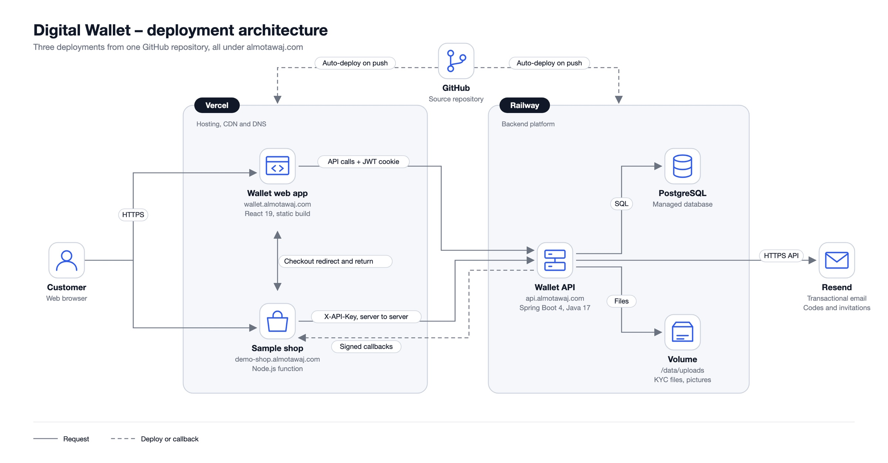

# Deployment

[← Back to the README](../README.md)

**Backend – Railway** (service root directory `/backend`, PostgreSQL plugin, custom domain `api.almotawaj.com`):

1. Attach a **Volume** mounted at `/data` (uploaded KYC files live in `/data/uploads`).
2. Set the variables below and deploy.

| Variable                       | Value                                                                                  |
| ------------------------------ | -------------------------------------------------------------------------------------- |
| `SPRING_PROFILES_ACTIVE`       | `prod`                                                                                 |
| `DB_URL`                       | `jdbc:postgresql://${{Postgres.PGHOST}}:${{Postgres.PGPORT}}/${{Postgres.PGDATABASE}}` |
| `DB_USERNAME` / `DB_PASSWORD`  | `${{Postgres.PGUSER}}` / `${{Postgres.PGPASSWORD}}`                                    |
| `JWT_SECRET` / `OTP_SECRET`    | two different `openssl rand -hex 32` values                                            |
| `JWT_EXPIRATION_MS`            | optional, default `86400000` (24 h)                                                    |
| `CORS_ALLOWED_ORIGINS`         | `https://wallet.almotawaj.com,https://www.wallet.almotawaj.com`                        |
| `RESEND_API_KEY` / `MAIL_FROM` | Resend key and verified sender                                                         |
| `MAIL_LOGO_URL`                | optional logo URL for emails                                                           |
| `APP_URL`                      | `https://wallet.almotawaj.com` (email links)                                           |
| `STORAGE_ROOT`                 | optional, default `/data/uploads`                                                      |
| `SEED_TOKEN` / `SEED_PASSWORD` | optional, enables `POST /api/seed` (see the [backend guide](../backend/README.md#seeding)) |
| `RAILPACK_JDK_VERSION`         | `17`                                                                                   |

Email is sent through Resend's HTTPS API because Railway blocks outbound SMTP on non-Pro plans.

**Frontend – Vercel** (root directory `frontend`, ignored build step: _only build production_, domain `wallet.almotawaj.com`): set `VITE_API_URL=https://api.almotawaj.com`. `frontend/vercel.json` provides the SPA rewrite and security headers (CSP, HSTS, frame, referrer and permissions policies). API and web app share `almotawaj.com`, so the `SameSite=Strict` cookie works across them.
